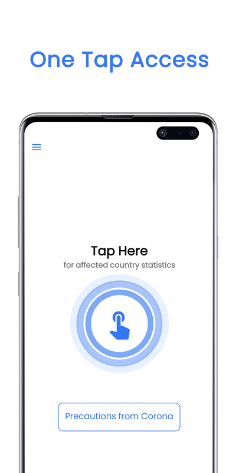
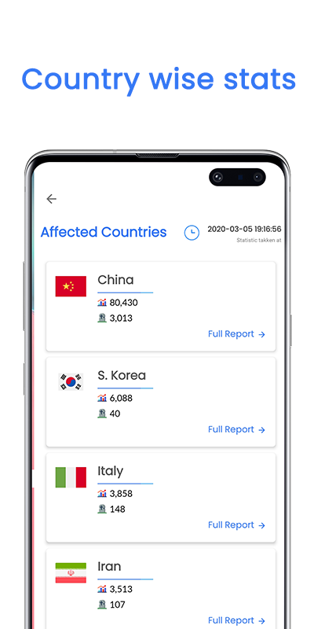
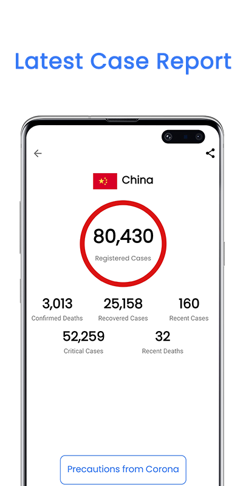

# Corona Monitor
Quick and latest Statistic for Corona Virus Spread across the world. 
Through this app, you can access the country-wise data and report for Coronavirus or COVID-19 spread in world.

# API Source
<b>Coronavirus monitor</b> 
https://rapidapi.com/astsiatsko/api/coronavirus-monitor  
<b>Coronavirus monitor Overview</b> 
This API will provided online information about where coronavirus is currently active, how many cases in the world, etc. This API provides realtime information about the coronavirus situation. We monitor various resources and grab the most relevant for you twice per hour.

# What is CoronaVirus ?
<B>What is CoronaVirus or COVID-19?</b> 
Coronaviruses (CoV) are a large family of viruses that cause illness ranging from the common cold to more severe diseases such as Middle East Respiratory Syndrome (MERS-CoV) and Severe Acute Respiratory Syndrome (SARS-CoV). A novel coronavirus (nCoV) is a new strain that has not been previously identified in humans. 

<b>How does COVID-19 Spread?</b> 
People can catch COVID-19 from others who have the virus. The disease can spread from person to person through small droplets from the nose or mouth which are spread when a person with COVID-19 coughs or exhales. These droplets land on objects and surfaces around the person. Other people then catch COVID-19 by touching these objects or surfaces, then touching their eyes, nose or mouth. People can also catch COVID-19 if they breathe in droplets from a person with COVID-19 who coughs out or exhales droplets. This is why it is important to stay more than 1 meter (3 feet) away from a person who is sick.
 
# Screenshots
  
